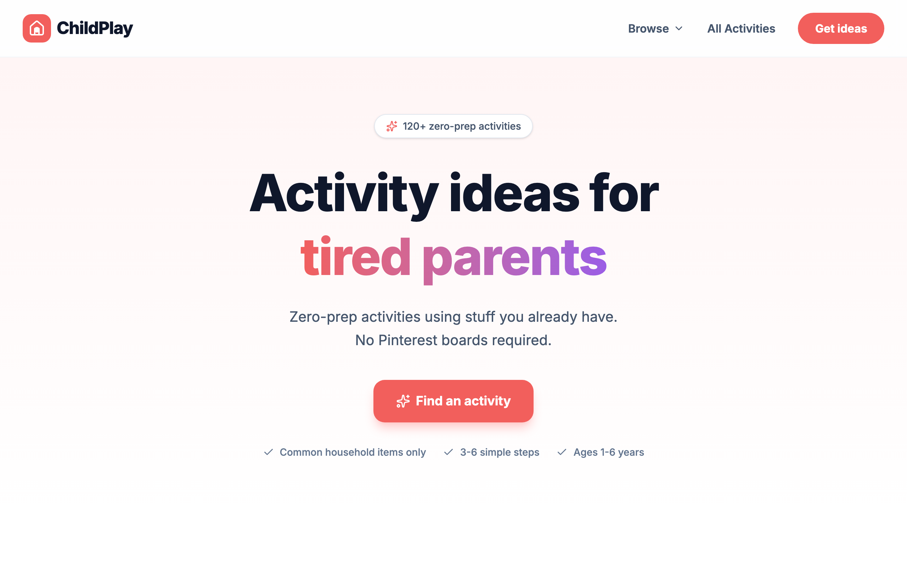

# ChildPlay Replica

 a free library of zero-prep activity ideas for kids ages 1-6. Built with React + TypeScript + Vite + Tailwind CSS.

## Screenshots




## Features

- **Activity Generator** — filter by age (1-6), duration, space requirement, and energy level, then get a random activity
- **Tired Parent Mode** — shows low-energy activities you can supervise from the couch
- **Category Browsing** — browse by age, type (Sensory, Craft, Active, Learning, Creative), or situation (rainy day, sick day, screen-free, etc.)
- **Activity Detail** — step-by-step instructions, materials list, variants, and related activities
- **AI Image Generation** — optional Gemini API integration to generate activity images (falls back to Unsplash)
- **IndexedDB Caching** — generated images are cached locally for fast subsequent loads
- **Responsive Design** — works on mobile, tablet, and desktop

## Tech Stack

- React 19 + TypeScript
- Vite 6
- Tailwind CSS 4
- React Router 7
- Lucide React (icons)
- Motion (animations)
- Google GenAI SDK (optional, for image generation)

## Getting Started

**Prerequisites:** Node.js 18+

```bash
# Install dependencies
npm install

# Start dev server
npm run dev
```

Visit `http://localhost:3000`.

### Optional: AI Image Generation

To enable AI-generated activity images, create a `.env` file:

```
GEMINI_API_KEY=your_gemini_api_key_here
```

Without the key, the app uses Unsplash placeholder images.

## Scripts

| Command | Description |
|---|---|
| `npm run dev` | Start dev server on port 3000 |
| `npm run build` | Build for production |
| `npm run preview` | Preview production build |
| `npm run lint` | TypeScript type checking |

## Project Structure

```
src/
├── App.tsx                  # Router configuration
├── main.tsx                 # Entry point
├── index.css                # Global styles
├── data/
│   └── activities.ts        # Activity data (15 activities)
├── lib/
│   ├── imageService.ts      # Gemini AI image generation + IndexedDB cache
│   ├── filterActivities.ts  # Activity filtering logic
│   └── utils.ts             # Utility functions
├── components/
│   ├── Layout.tsx            # App layout with Header + Footer
│   ├── Header.tsx
│   ├── Footer.tsx
│   ├── ActivityCard.tsx      # Grid card component
│   ├── ActivityListCard.tsx  # List view card component
│   ├── ActivityImage.tsx     # Image component with loading/error states
│   ├── ActivityGenerator.tsx # Filter + generate UI
│   └── FAQAccordion.tsx
└── pages/
    ├── Home.tsx              # Landing page
    ├── Activities.tsx        # Browse all activities
    ├── ActivityDetail.tsx    # Single activity page
    ├── CategoryPage.tsx      # Filtered category pages
    ├── About.tsx
    ├── Contact.tsx
    ├── Privacy.tsx
    └── Terms.tsx
```
